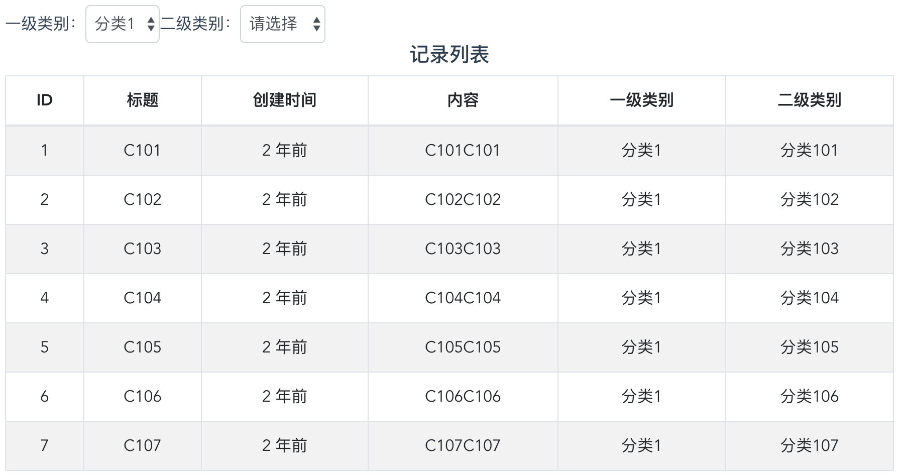

# 实战小任务

>时间：一小时，特别提醒：请自行评估各功能点所需时间，合理安排时间。

# 1. 代码提交

> fork本仓库代码到自己的github下，并在根目录下用自己姓名的拼音（驼峰命名法）新建一个文件夹，并在自己的文件夹下开始开发。完成之后发起一个PR。
> 
> 注意：请妥善处理.gitignore列表，保持代码库干净整洁
> 
> 如需对项目代码做额外说明，请在自己的文件夹下写README.md

# 2. 任务说明

## 2.1 任务目标

利用给定的后端接口，自行建立vue工程，完成如下面的效果示意图展示的页面。



注意：

> 1: 一级类别和二级类别具有联动关系
> 
> 2: 一级类别或二级类别变化后，自动检索并刷新下方表格中的记录列表
>
> 3: 记录列表中的创建时间，**并非** 直接显示后端返回的结果，应计算每条记录中的 ```created_time``` 字段代表的时间距离当前时间的间隔（提示：可以考虑使用moment.js等）。
>
> 4: 记录列表中的“一级类别”和“二级类别”两列，用于显示每条记录所属类别的名称（根据记录的classify字段分别计算）
> 
> 5: 为记录列表增加分页检索功能

## 2.2 后端接口：

### 2.2.1 获取类别（classify）列表（对应界面上方两级类别列表）

> 服务地址

``` html
GET http://interview-test.ipmapp.cn/api/v1/classify?parent=0
```

| 名称  | 说明  | 备注
|:----:|:----:|:----:|
|parant|父类别索引|0表示检索一级类别

> 服务响应的格式：

``` json
{
    "code":200, //200~299之间表示成功
    "page":{
        "count":5,
        "size":5,
        "current":1
    },
    "data":[
        {
            "id":1, //类别的id
            "parent":0, //所属上级类别的id
            "name":"分类1" //类别的名称
        }
    ]
}
// 说明：一级类别和二级类别的区别在于，一级类别的parent为0，而二级类别的parent不为0，其代表了所属的一级类别的id。所以，根据parent即可找到二级类别所属的一级类别的信息
```

### 2.2.2 获取记录（record）列表(上面的表格数据区域)

> 服务地址

``` html
GET http://interview-test.ipmapp.cn/api/v1/record?classify=0&page=1&pageSize=5
```

| 名称  | 说明  | 备注
|:----:|:----:|:----:|
|classify|所属类别索引(可选)|缺省或0表示检索所有记录|
|page|页码(可选)|用于分页获取数据时指定页码|
|pageSize|每页包含的记录的条数(可选)|用于分页时指定每页的大小|

> 服务响应的格式：

``` json
{
    "code":200,//200~299之间表示成功
    "page":{
        "count":25, //符合检索条件的记录的总数量
        "size":25, //当前页的数量
        "current":1 //当前页码
    },
    "data":[
        {
            "id":1,
            "classify":6, //所属二级类别的id
            "title":"C101", //标题
            "content":"C101C101", //内容
            "created_time":"2018-01-01 12:00:00" //创建时间
        }
    ]
}
```
